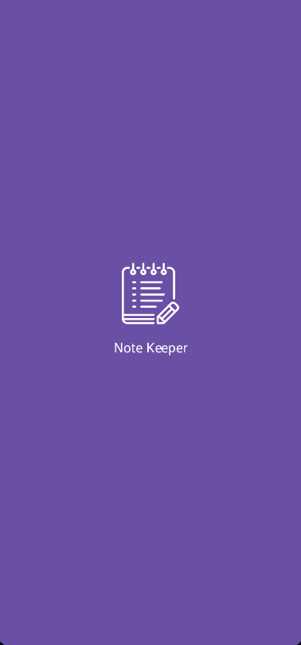
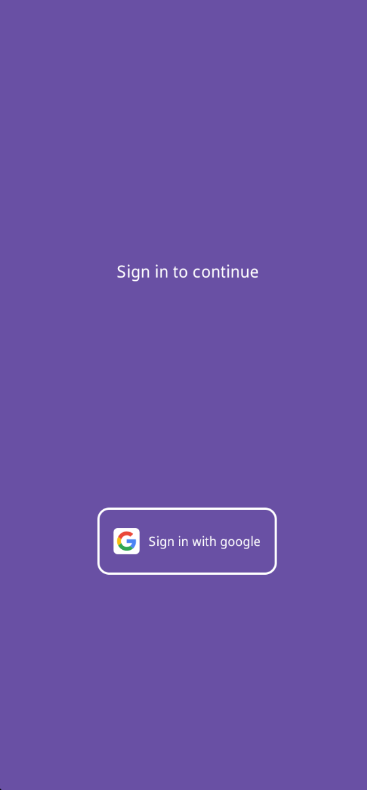
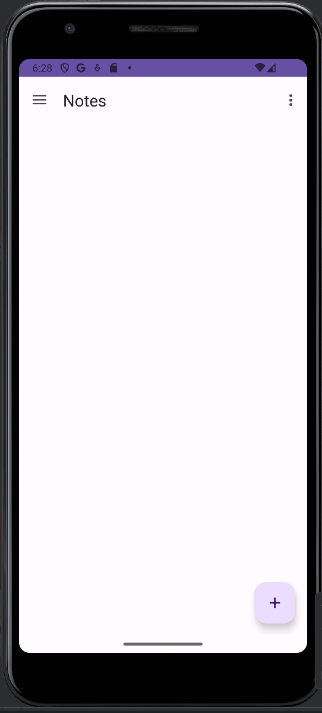
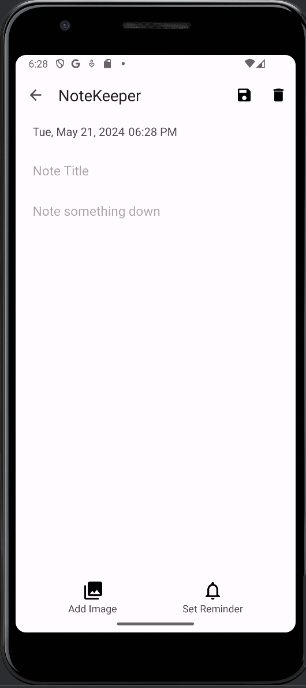
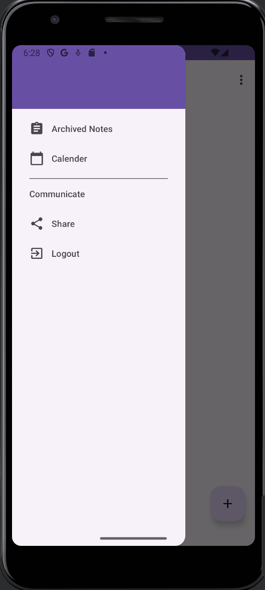
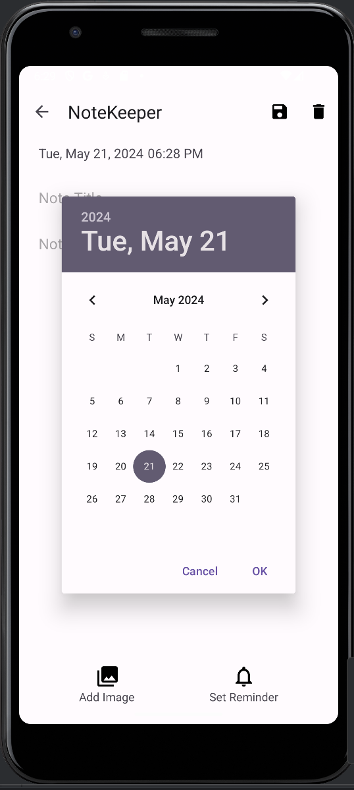
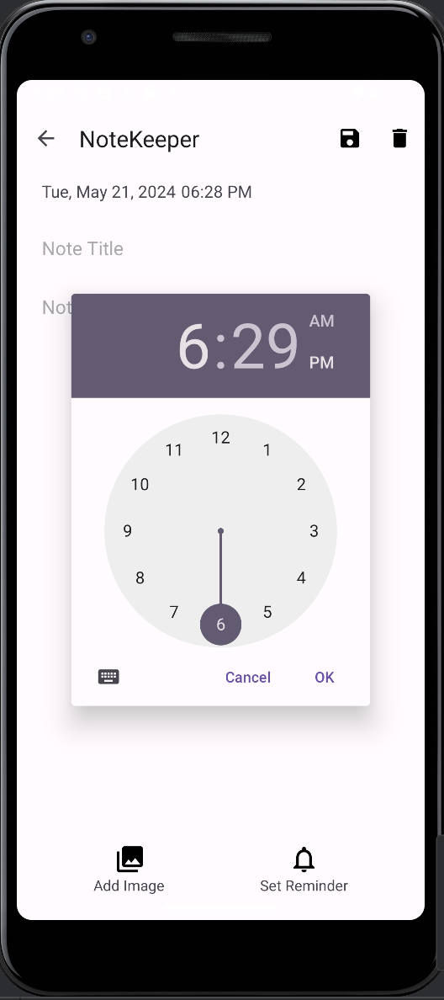
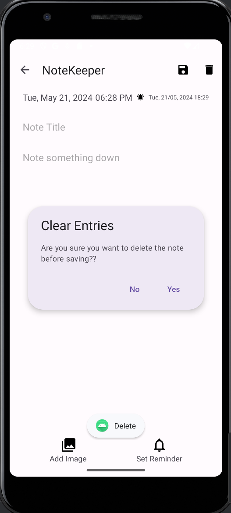

# Note Keeper

Simple android app for university assignment with Firebase auth,store,realtime db. Note,Save,Remind,Repeat

- Note everything you want with the images and displaying current day/month/year.
- Notes are saved via Firebase firestore, realtime database.
- Login via Google Account

# Run

- To run this project first, create firebase auth, firestore, database then connect them with [firebase](https://console.firebase.google.com)
- Run gradle options, sync and run project.
  
## Screens

  
  
  
  
  
  
  
  

  

## Tools
- Firebase
- Kotlin
- MVVM
- Hilt
- Database
- Dagger

## Video

https://github.com/NPaugust/Next-Wave-Connect/assets/72886935/eab5d406-f48a-41f5-9e14-4f0c3491f6e6

> did it in a hurry
